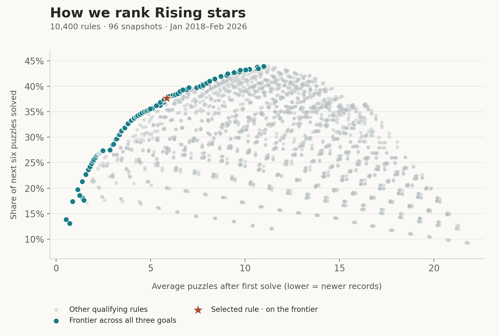
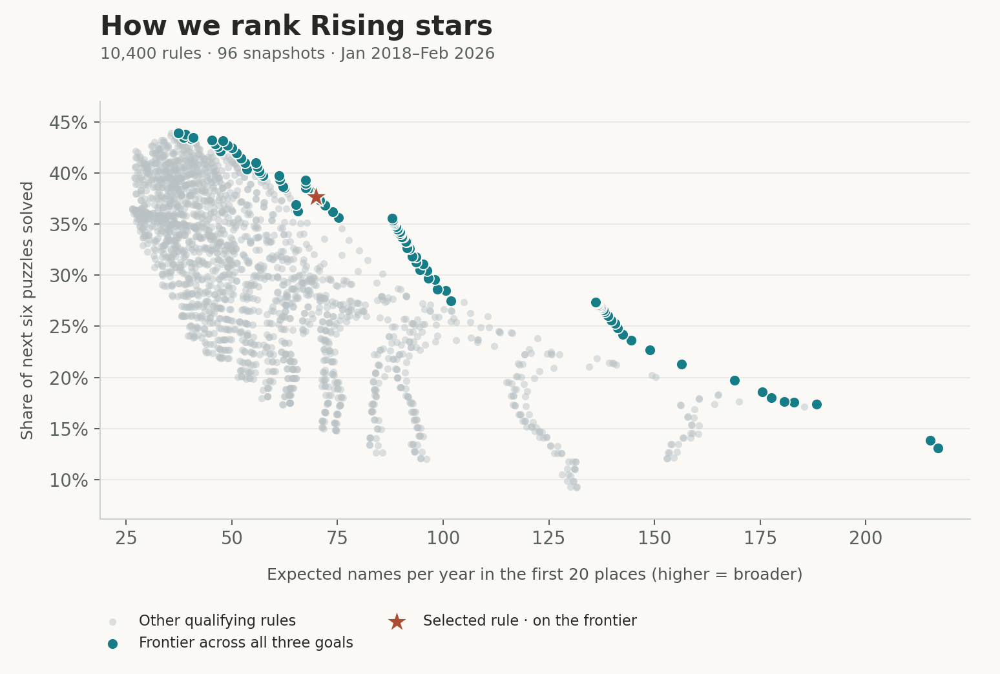

# How Rising stars works

**LLM-authored. Read at your discretion.** Study date: 6 September 2026. Data through August 2026.

## Ranking rule

A name must first appear within the **18 calendar months** through the latest completed puzzle month. It needs **at least two solves** and **at least three completed puzzles with published solver lists** from its first appearance, including the debut puzzle.

The solve rate is **solved puzzles / observed puzzles**. Count the debut puzzle in both numbers. Open puzzles, missing months and unavailable solver lists count in neither number. A 2/2 record must wait; a 2/3 record qualifies. Higher rates rank first, then more solves. Identical records share a rank.

This rule keeps the score between 0% and 100%. The observation requirement asks for evidence beyond an immediate 2/2 debut. It is a practical balance of continued participation, newer records and more names appearing near the top.

## What the study measures

The archive contains **128 completed puzzles and 16,314 exact published names**. We assess the first twenty ranking positions at **96 completed monthly snapshots**, January 2018–February 2026. Earlier records supply history; the latest six completed puzzles supply outcomes. March and November 2020 are absent. The start permits at least two years of observed prior history for every candidate window.

At each snapshot, use only records up to that puzzle month. Measure three outcomes:

1. **Later participation:** the share of the next six completed puzzles solved by displayed names; higher is better.
2. **Record age:** the average number of published opportunities after debut among displayed names; lower means newer records. This is not time to first discovery.
3. **Exposure:** expected distinct names in the first twenty positions, annualized across the period; higher means broader exposure.

Only rules that fill at least 95% of the twenty places on average qualify for the main frontier. The published rule fills all twenty places at every evaluated snapshot. A separate frontier checks that the fill requirement holds in each era.

Boundary ties receive equal fractional attention slots. Expected exposure assumes independent draws within those ties at each snapshot. This is a study convention, not measured website traffic. All eligible names remain accessible in the product. Whole boundary ties and persistent tie orders are checked separately.

## Search and findings

We test **10,400 configurations**: every integer debut window from 1 to 24 months, every feasible minimum solve count and observation count, and four fixed ordering methods. The methods are solve rate, total solves, a Wilson lower score with z=1.64, and a beta-binomial mean. A solve threshold already implies at least that many opportunities, so logically redundant thresholds are removed.

The search produces **6,079 distinct selection results**. Of these, **2,104 distinct results / 3,264 configurations** pass the fill requirement. **97 distinct results** form the frontier across all three goals. No other qualifying rule can improve a frontier result on one goal without worsening another.

The selected **18-month / two-solve / three-observed-puzzle** rule is on this full frontier in the pooled results and in all three chronological eras. It also remains on the frontier when the fill requirement must hold in every era.





Teal points show the full three-goal frontier in both projections. The highlighted rule is itself on that frontier. Equivalent configurations share a point. These plots do not imply a separate two-goal frontier or a continuous curve between discrete rules.

| Period | Later participation | Record age | Expected names/year |
|---|---:|---:|---:|
| All 96 snapshots | **37.67%** | **5.85** | **69.89** |
| 2018–2020 | 35.50% | 6.09 | 66.13 |
| 2021–2023 | 31.23% | 5.70 | 77.96 |
| Jan 2024–Feb 2026 | 49.44% | 5.73 | 78.87 |

Study percentages describe later participation, not the solve rate beside a current name. Exposure is the whole period's distinct names divided by its length; unequal eras' values are not directly comparable annual trends.

## Stability checks

The selected rule retains useful performance under different treatments of ties and recent data:

| Check | Later participation |
|---|---:|
| Fractional twenty-position evaluation | 37.67% |
| Mean across 100 fixed identity tie orders | 37.65% |
| Whole boundary ties included | 35.37% |
| Final snapshot excluded | 37.48% |

Whole ties expand the average evaluated list to 22.81 names, so that row uses a different attention budget. The study also includes paired six- and twelve-calendar-month block resampling. These are exploratory sensitivity checks, not independent confirmation after selecting a rule or guaranteed population confidence intervals. Missing calendar months remain absent during resampling.

Seventeen- and nineteen-month versions also lie on the frontier in all three eras. Their pooled participation is 37.35% and 38.02%, with progressively older records and less exposure. Eighteen is a readable compromise, not a uniquely optimal constant. A frontier identifies trade-offs; the product still needs to choose its priorities. [Boyd and Vandenberghe, section 4.7](https://web.stanford.edu/~boyd/cvxbook/bv_cvxbook.pdf).

## Limits

This is a retrospective analysis of an archive whose outcomes have already been examined. Scores use past-only records at each snapshot, following [rolling-origin evaluation](https://otexts.com/fpp3/tscv.html). The beta method fits only debut cohorts whose first six post-debut outcomes are already complete at that origin; the guaranteed debut success is excluded from its fitted likelihood.

The search is exhaustive within the declared integer thresholds and four methods, not every possible model or continuous parameter. More tested rules do not create more independent observations. Searching many settings can also fit noise in the evaluation itself. [Cawley and Talbot, 2010](https://www.jmlr.org/beta/papers/v11/cawley10a.html).

Names recur and six-puzzle outcome windows overlap. Published lists may contain later revisions. Exact names can identify teams or split one person across aliases; identities are not inferred. Missing submissions do not reveal attempts, private solves, speed or innate talent. The measurable outcome is later published participation.

## Reproduce

Input SHA256: `bb4438c67cd513a9276bf9c3876d6b4b73b17155d75028a7ae01a8bcb8d9ee33`.

From the repository root, with Python and NumPy installed:

```text
python analysis/rising-stars/expanded/sweep.py
python analysis/rising-stars/expanded/archive_results.py
python analysis/rising-stars/expanded/current.py
python analysis/rising-stars/expanded/robustness.py --selection analysis/rising-stars/expanded/review-choices.json
python analysis/rising-stars/expanded/export_article.py --check
```

Use Matplotlib to regenerate the standalone figures:

```text
python analysis/rising-stars/expanded/plots.py
```

All configuration results are retained in compressed JSON under [results](results). Scripts regenerate uncompressed working files locally. The [protocol](protocol.md), [metadata](results/metadata.json), [selection audits](results/expanded_audit.json) and [robustness results](robustness-results.json) record source hashes, definitions and checks. The independent robustness implementation matches all 96 rolling priors and 1,152 shortlisted per-origin metric records exactly.
