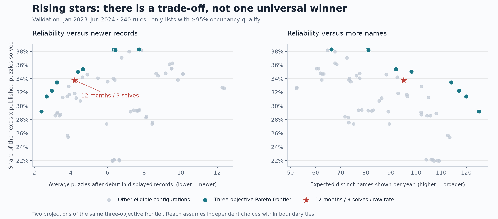
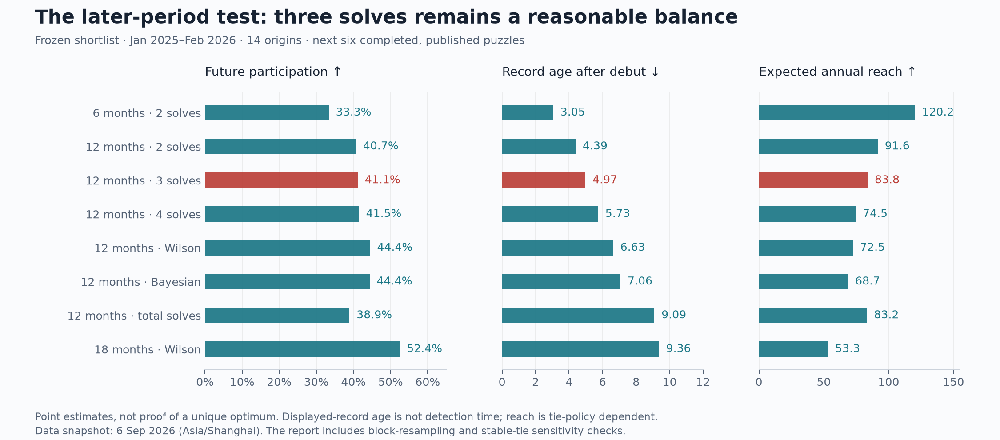

# Rising stars: a bounded rate and evidence-based eligibility

Study date: **6 September 2026**, Asia/Shanghai. Recommendation frozen before the later-period test.

## Recommendation

Use **a 12-month debut window, at least three solved puzzles, and the percentage of published puzzles solved since debut**. Count the debut puzzle in both numerator and denominator. Rank by that percentage, then by more solved puzzles; identical records share a rank.

This is a defensible balance of newness, evidence, and simplicity. It is **not a statistically established universal optimum**. The Pareto analysis identifies several useful compromises. A confidence-adjusted score is a valid alternative if predicting continued participation matters more than featuring newer names.

The production ranking policy has deliberately not been changed in this research release: the user requested analysis and consultation first. The accompanying text-integrity repair is separate and ready for deployment.

## Why the current number exceeds one

Both the Python aggregator and the TypeScript fallback divide total solves by the difference between debut and current month. That counts month **intervals**, while the numerator includes both endpoint puzzles.

Krish Yadav appears in July, August, and September 2026. The current code calculates **3 / 2 = 1.5**. An inclusive record would be **3 / 3 = 100%**. Nineteen of the twenty current Rising stars entries exceed one because of this error. The defect is in both calculation paths, not the table's decimal formatting.

Simply adding one fixes that example but leaves two policy issues:

- **The current puzzle is still open.** A name absent today may appear tomorrow. For a stable comparison, include only puzzles with both a published solution and a nonempty solver list. Through this snapshot, that means August 2026. Krish then has two completed results, July and August, and would need another completed result to meet the three-solve rule.
- **An unknown list is not a failure.** Exclude unavailable lists from both counts. Count actual puzzle opportunities rather than assumed elapsed months. Jane Street describes publication as every month or two; a paired puzzle represented by one archive record is one opportunity in this dataset. [Jane Street puzzles](https://www.janestreet.com/puzzles/)

For snapshot month T and a name's first recorded appearance D:

```text
Eligible: 0 ≤ calendar_month(T) − calendar_month(D) < 12
          and S ≥ 3

S = distinct completed, published puzzles solved from D through T
E = all completed puzzles with published solver lists from D through T

Solve rate = S / E        (0 ≤ S/E ≤ 1)
```

The 12 months define who is new. The denominator starts at debut. Dividing everyone by 12 instead would penalize months before they first appeared and produce exactly the same ordering as total solve count. That alternative was included in the study and performed worse on the selected objectives.

## What was tested

The corrected local archive contains 151 puzzle records. **128 completed puzzles with published lists, November 2015–August 2026, cover 16,314 exact solver names**. The live September list is excluded. Twenty-two early records have unavailable lists; March and November 2020 are absent. Those months contribute neither opportunities nor misses. The first observed November 2015 cohort is excluded as a newcomer cohort because its earlier participation is unknown.

The grid contains **240 configurations**:

| Parameter | Values tested |
|---|---|
| Debut window | 6, 9, 12, 18 calendar months |
| Minimum solves | 2, 3, 4, 5, 6 |
| Minimum observed opportunities | 1, 3, 6 |
| Ordering | Raw inclusive rate; total solves; Wilson lower bound; empirical Bayes mean |

Wilson uses z=1.64. It rewards a high observed rate with more evidence. The empirical Bayes alternative shrinks short records toward a prior estimated only from earlier cohorts. Both statistical alternatives exclude the guaranteed debut success from their likelihood; otherwise every newcomer starts with an artificially favorable sample. These are ranking heuristics, not calibrated estimates of innate ability. [NIST on Wilson bounds](https://www.itl.nist.gov/div898/handbook/prc/section2/prc241.htm), [Stan on partial pooling](https://mc-stan.org/learn-stan/case-studies/pool-binary-trials.html)

The frozen empirical Bayes prior is Beta(0.18097, 2.30580), fitted by beta-binomial moments from 3,669 exact-name records with six post-debut outcomes completed by December 2022. Its mean is 7.28%; debut success is not one of those six outcomes. Development refits the prior at each origin using only earlier completed outcomes; validation, test, and the current comparison use the frozen prior. No future validation or test outcomes were used to fit it.

At each historical snapshot, select twenty display slots using solves assigned to that puzzle month or earlier. These are retrospective records, not saved publication-time snapshots. Measure how many of the **next six published puzzles** those names solve. This is rolling-origin evaluation, not a random split that mixes past and future records. [Forecasting: Principles and Practice](https://otexts.com/fpp3/tscv.html)

| Period | Snapshot months | Number of snapshots | Purpose |
|---|---|---:|---|
| Development | Jan 2018–Jun 2022 | 52 | Build and audit comparisons |
| Validation | Jan 2023–Jun 2024 | 18 | Choose a shortlist and recommendation |
| Untouched test | Jan 2025–Feb 2026 | 14 | Evaluate the frozen shortlist |

The six-puzzle outcome horizons finish before the next selection period. The recommendation and seven comparators were written into [selection.json](selection.json) before test scoring or inspection of the August 2026 ranking. They were not retuned after seeing the test.

## What Pareto analysis means here

Three objectives were declared before validation:

1. **More future participation:** the fraction of the next six puzzles solved by displayed names.
2. **Newer displayed records:** fewer completed opportunities after debut, averaged across displayed names. This measures record age, not time to first discovery.
3. **Broader exposure:** more distinct names shown per year.

Require at least 95% average occupancy of the twenty slots so a tiny list cannot look good by avoiding hard selections. A rule is dominated when another does at least as well on all three objectives and better on at least one. The remaining rules form the Pareto frontier. Choosing among them requires a preference about the trade-offs; Pareto analysis cannot manufacture that preference. [Boyd and Vandenberghe, §4.7](https://web.stanford.edu/~boyd/cvxbook/bv_cvxbook.pdf)

Boundary ties receive fractional slots, avoiding arbitrary alphabetical winners in the analysis. Expected annual reach initially assumes independent choices inside those ties at each snapshot. Stable tie ordering is checked separately below.



Validation produces **10 distinct Pareto behaviors**. The proposed raw 12-month / three-solve rule is one of them. Its future participation is 33.76%, compared with 33.56% for four solves; it also shows newer records (4.20 versus 6.00 opportunities after debut) and more names (95.12 versus 74.01 per year). The four-solve rule is therefore dominated in validation.

Two solves is a real trade-off: 32.23% future participation, younger records at 2.96 opportunities, and 117.10 names per year. More restrictive windows and statistical ordering supply other frontier points. Twelve months remains a product choice supported by a useful frontier point, not a uniquely discovered natural constant.

## Results on the later period

**Future participation below is an evaluation outcome, not the solve-rate percentage displayed beside a current solver.** All eight shortlisted rules filled all twenty slots in this period.

| Frozen rule | Future participation ↑ | Average opportunities after debut ↓ | Expected names/year ↑ |
|---|---:|---:|---:|
| Raw, 6 months / 2 solves | 33.33% | 3.05 | 120.19 |
| Raw, 12 months / 2 solves | 40.66% | 4.39 | 91.57 |
| **Raw, 12 months / 3 solves** | **41.14%** | **4.97** | **83.77** |
| Raw, 12 months / 4 solves | 41.47% | 5.73 | 74.54 |
| Wilson, 12 months / 3 solves | 44.45% | 6.63 | 72.48 |
| Empirical Bayes, 12 months / 3 solves | 44.36% | 7.06 | 68.71 |
| Total solves, 12 months / 3 solves | 38.91% | 9.09 | 83.23 |
| Wilson, 18 months / 2 solves | 52.44% | 9.36 | 53.30 |



Four solves gains only **0.33 percentage points** over three, while displaying records about 0.76 opportunities older and roughly nine fewer names per year. That does not justify making the entry requirement stricter for this purpose.

Wilson gains **3.31 percentage points**, with records 1.66 opportunities older and about eleven fewer names per year. That gain is worth acknowledging: confidence-adjusted ordering is useful if continued participation is the main goal. It also makes the visible rate and sorting score different, requiring an additional explanation. The raw rate remains the recommendation for a simple newcomer board.

The 18-month Wilson rule has the strongest future participation among the frozen candidates. Its displayed records are almost twice as old as the recommendation's, and its reach is much lower. It serves a different preference and expands the user's proposed 12-month newcomer window.

## Sensitivity and uncertainty

- **Three versus four solves:** paired circular calendar-block resampling, 4,000 samples each, gives an exploratory difference range of −1.19 to +2.31 percentage points using three-month blocks; six-month blocks give −1.13 to +2.04. Both include zero. There is no persuasive advantage to four here.
- **Wilson's gain:** the same exploratory ranges are +0.92 to +5.82 points and +1.24 to +5.14. Its participation gain persists under these checks, alongside its newness/reach cost.
- **Stable ties:** across 100 seeded persistent tie orders, the recommendation averages 41.12% future participation and 83.80 names/year, close to the primary 41.14% and 83.77. Its reach ranges from 78.86 to 88.29 across tie orders. These are policy-variation ranges, not confidence intervals.
- **Latest list still maturing:** excluding the final test origin, whose horizon ends at recently archived August 2026, gives 41.48% for the recommendation versus 41.14% in the full test.
- **Shorter outcome horizon:** the same frozen rule solves 49.33% of the next three puzzles, versus 41.14% of the next six. This comparison cannot separate changes in persistence from puzzle difficulty or calendar effects; it was not used to change the chosen rule.

Only fourteen test origins are available, with recurring names and overlapping outcomes. Block resampling preserves some local dependence but assumes stability and joins the last month to the first. Its ranges should not be presented as rigorous population confidence intervals or proof that a parameter is optimal. Full outputs are in [sensitivity.json](results/sensitivity.json).

## What the proposed board would show today

Using completed results through **August 2026**, the 12-month eligibility window is **September 2025–August 2026**, with 309 eligible exact names. The leading records are:

| Shared rank | Published name | Record | Solve rate |
|---|---|---:|---:|
| 1 | Joshua Kindler | 12/12 | 100% |
| 2 | Daniel Shields; Marianna Sykopetritou | 7/7 each | 100% |
| 4 | Dawson Yao; Denis Abuti; Lucas Reymond; Umair Hundekar | 5/5 each | 100% |
| 8 | 29 names tied | 4/4 each | 100% |

This exposes another current UI problem: equal records should not receive different performance ranks. The twenty-slot study shares thirteen remaining slots across the 29-way boundary tie. For the product, keep the whole tied group accessible and use shared rank 8, rather than implying one arbitrary name is better. Evaluating twenty attention slots does not prove that showing all 36 tied-boundary entries will have identical exposure metrics.

Suggested columns: **Rank · Solver · Solve rate · Record · Debut**. Replace `PER MONTH` with `Solve rate`, show `100%` beside `4/4`, and retain the inline information icon next to the selected Rising stars tab.

Suggested explanation:

> First recorded within the 12 calendar months through the latest completed puzzle month, with at least 3 puzzles solved. Solve rate is the share of published puzzles solved since debut, including the first. Open puzzles and missing solver lists are excluded. Higher rates rank first; more solves break ties. Identical records share a rank.

No extra three-month waiting rule is needed: three distinct solved puzzles already imply at least three observed opportunities. A 12-month calendar window should be anchored to the latest completed puzzle month used for this board, with that month displayed.

## Limits that matter

Published participation is the only measurable target here. The archive does not tell us who attempted a puzzle, how long it took, or whether someone stopped submitting despite solving privately. It cannot establish innate talent or puzzle-solving speed. Names may identify teams, split one person across aliases, or combine different people. Apart from verified encoding repairs, no identity merging was inferred.

This is a reconstruction from the current archive, not preserved publication-time snapshots. Later additions may affect historical results; excluding the latest outcome does not remove all such hindsight. Puzzle difficulty and participation also change over time. The study neither difficulty-adjusts records nor proves that the finite 240-rule grid contains the global best policy. More thresholds and models could overfit this small history.

## Reproduce and review

Input: `public/data/data.json`, SHA256:

`bb4438c67cd513a9276bf9c3876d6b4b73b17155d75028a7ae01a8bcb8d9ee33`

Python 3.12.14, NumPy 2.3.5 for the study. Matplotlib 3.11.1 for standalone PNG/SVG figures. Run from the repository root in an environment with these packages:

```text
python analysis/rising-stars/study.py
python analysis/rising-stars/study.py --holdout-selected analysis/rising-stars/selection.json
python analysis/rising-stars/sensitivity.py --expected-input-sha256 bb4438c67cd513a9276bf9c3876d6b4b73b17155d75028a7ae01a8bcb8d9ee33
python analysis/rising-stars/plots.py
```

The scripts record input, implementation, and frozen-selection hashes. The default study run does not evaluate holdout outcomes. [Protocol](protocol.md), [study code](study.py), [frozen selection](selection.json), [holdout results](results/holdout_selected.json), [current tied groups](results/current_top_groups.json), [text-integrity audit](../text-integrity.md).

Validation checks cover bounded rates, chronological feature/outcome separation, prior availability, duplicate puzzle-month detection, within-puzzle deduplication, boundary ties, Pareto dominance, and consistency between primary and sensitivity aggregates. The independent method review found no blocking mathematical error.
