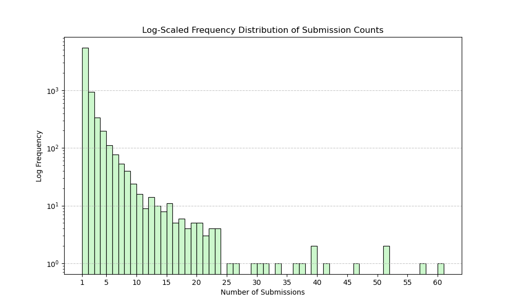

# 🧩Jane Street Puzzle Leaderboard

This program is designed to scrape and analyze the correct puzzle submissions from the [Jane Street Puzzles](https://www.janestreet.com/puzzles/) Archive. It provides insights into the most frequent solvers and visualizes the distribution of submission counts.

## 📊 Current Stats (as of August 9, 2024)
### Number of Unique Puzzle Solvers: 7361
### 🏆 Top 28 Solvers
| Rank | Name                                | Counts |
|------|-------------------------------------|--------|
| 1    | Calvin Pozderac                     | 60     |
| 2    | Senthil Rajasekaran                 | 57     |
| 3    | Karl Mahlburg                       | 51     |
| 3    | Sean Egan                           | 51     |
| 5    | Keith Schneider                     | 46     |
| 6    | Aaditya Raghavan                    | 41     |
| 7    | Heidi Stockton                      | 39     |
| 7    | Gareth Owen                         | 39     |
| 9    | Sébastien Geeraert                  | 37     |
| 10   | Lazar Ilic                          | 36     |
| 11   | Evan Semet                          | 33     |
| 12   | Cubist                              | 31     |
| 13   | Michael DeLyser                     | 30     |
| 14   | Hutama                              | 29     |
| 15   | Guillermo Wildschut                 | 26     |
| 16   | Sanandan Swaminathan                | 25     |
| 17   | Dylan Peifer                        | 23     |
| 17   | Vinay Kameswaran, Shawn Ng, Dave Cox| 23     |
| 17   | Wula                                | 23     |
| 17   | Scott Okuno                         | 23     |
| 21   | Sébastien G                         | 22     |
| 21   | Sandip Ghoshal                      | 22     |
| 21   | Ian Sleightholme                    | 22     |
| 21   | fekstr                              | 22     |
| 25   | Will Christerson                    | 21     |
| 25   | Kilian B.                           | 21     |
| 25   | Stephen Emet                        | 21     |
| 28   | Dimas Ramos                         | 20     |
| 28   | Stranger                            | 20     |
| 28   | Tomek Bialach                       | 20     |
| 28   | Miguel Barbosa Pereira              | 20     |
| 28   | Alexander Dineen                    | 20     |

### Submission Distribution


Note that there is a gap in the graph for submission counts less than 20; hence, the displayed leaderboard consists of solvers with more than 20 successful submissions. For a full list of the leaderboard, please use the script to generate it or reference the uploaded database at your convenience. (This part will be added later.)

## ✨Features

- **Scrape Submissions:** Automatically fetch and process puzzle submissions.
  - **Set Page Limits:** Specify the number of pages to scrape, or leave it unset to scrape all available pages.
  - **Current Month Not Applicable:** Even though Jane Street posts the current month's solver, since it is continuously updated throughout the month and has not been shown on the solution page, the current month's correct submissions will only be counted at the beginning of the next month's puzzle when the solution is revealed.
  - **Older Puzzles Limitation:** There is no public submissions list before November 2015; therefore, those are not counted. This limitation affects approximately 22 months/puzzles dating back to January 2014.
- **Unique Names:** Count the number of unique solvers.
  - **Counting Rule 1:** The program will treat each "name plate" as a whole. If multiple names are found and are formatted using delimiters, they will count as one solver (or actually one group of solvers in this case).
  - **Counting Rule 2:** When counting solvers, the program is not case-sensitive; e.g., submissions from "XD" and "xd" will be treated as from the same person.
- **Top K Solvers:** List the top k solvers with their submission counts.
- **Data Visualization:** Display submission frequencies with a histogram.

## ⚠️*WORK IN PROGRESS NOTICE*
 
- For a one-time analytical script, just run ```python main.py```. No databases, no nothing, just a plain simple script.
- The rest of the modules are initial steps toward building a fully-fledged web-hosted service, which will consist of a backend server and frontend UI. You are more than welcome to inspect and provide feedback in the upcoming updates!

## 🛡️Legal Disclaimer
This project is not affiliated with or endorsed by Jane Street. Data accessed through this script is used for clout purposes only.

By using this script, you agree to use it responsibly. The developers are not liable for misuse. If the script violates Jane Street's terms of service, corrective action will be taken immediately.

---
*This documentation was partially generated using ChatGPT.*