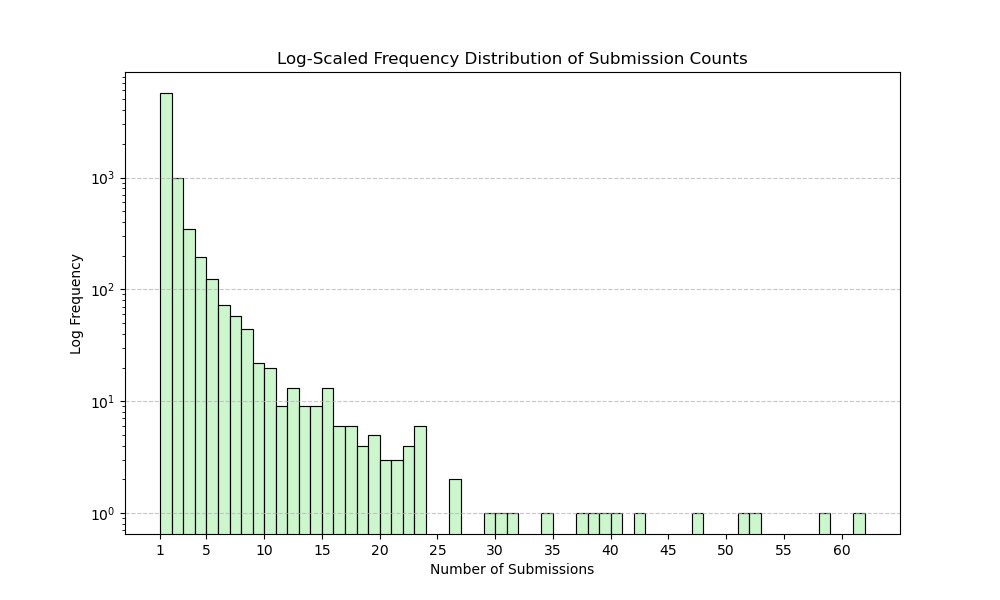

# 🧩Jane Street Puzzle Leaderboard

This program is designed to scrape and analyze the correct puzzle submissions from the [Jane Street Puzzles](https://www.janestreet.com/puzzles/) Archive. It provides insights into the most frequent solvers and visualizes the distribution of submission counts.

## 📊 Current Stats (as of September 4, 2024)
### Number of Unique Puzzle Solvers: 7673
### 🏆 Top 30 Solvers
| Rank | Name                                | Counts |
|------|-------------------------------------|--------|
| 1    | Calvin Pozderac                     | 61     |
| 2    | Senthil Rajasekaran                 | 58     |
| 3    | Karl Mahlburg                       | 52     |
| 4    | Sean Egan                           | 51     |
| 5    | Keith Schneider                     | 47     |
| 6    | Aaditya Raghavan                    | 42     |
| 7    | Gareth Owen                         | 39     |
| 7    | Heidi Stockton                      | 39     |
| 9    | Sébastien Geeraert                  | 38     |
| 10   | Lazar Ilic                          | 37     |
| 11   | Evan Semet                          | 34     |
| 12   | Cubist                              | 31     |
| 13   | Michael DeLyser                     | 30     |
| 14   | Hutama                              | 29     |
| 15   | Sanandan Swaminathan                | 26     |
| 15   | Guillermo Wildschut                 | 26     |
| 17   | Dylan Peifer                        | 23     |
| 17   | Vinay Kameswaran, Shawn Ng, Dave Cox| 23     |
| 17   | fekstr                              | 23     |
| 17   | Ian Sleightholme                    | 23     |
| 17   | Wula                                | 23     |
| 22   | Scott Okuno                         | 22     |
| 22   | Sandip Ghoshal                      | 22     |
| 22   | Sébastien G                         | 22     |
| 22   | Kilian B.                           | 22     |
| 22   | Will Christerson                    | 22     |
| 27   | Miguel Barbosa Pereira              | 21     |
| 27   | Alexander Dineen                    | 21     |
| 27   | Stephen Emet                        | 21     |
| 30   | Tomek Bialach                       | 20     |
| 30   | Stranger                            | 20     |
| 30   | Dimas Ramos                         | 20     |

### Submission Distribution


Note that there is a gap in the graph for submission counts less than 20; hence, the displayed leaderboard consists of solvers with more than 20 successful submissions. For a full list of the leaderboard, please use the script to generate it or reference the uploaded database at your convenience. (This part will be added later.)

## ✨Features

### Scrape Submissions
Automatically fetch and process puzzle submissions.
  - **Set Page Limits:** Specify the number of pages to scrape, or leave it unset to scrape all available pages.
  - **Current Month Not Applicable:** Even though Jane Street posts the current month's solver, since it is continuously updated throughout the month and has not been shown on the solution page, the current month's correct submissions will only be counted at the beginning of the next month's puzzle when the solution is revealed.
  - **Older Puzzles Limitation:** No public submissions list exists before November 2015; submissions from before this date are not counted, affecting roughly 22 months/puzzles dating back to January 2014.

### Unique Names
Count the number of unique solvers.
  - **Counting Rule 1:** Treats each "name plate" as a whole. Multiple names listed together are counted as one group of solvers.
  - **Counting Rule 2:** The counting is not case-sensitive; variations in capitalization are considered the same solver (e.g., "XD" vs. "xd").

### Top K Solvers
List the top k solvers with their submission counts.

### Data Visualization
Display submission frequencies using a histogram.

## ⚠️*WORK IN PROGRESS NOTICE*
 
- For a one-time analytical script, just run ```python main.py```. No databases, no nothing, just a plain simple script.
- The rest of the modules are initial steps toward building a web-hosted service. Might come some day.

## 🛡️Legal Disclaimer
This project is not affiliated with or endorsed by Jane Street. Data accessed through this script is used for clout purposes only.

By using this script, you agree to use it responsibly. The developers are not liable for misuse. If the script violates Jane Street's terms of service, corrective action will be taken immediately.

---
*This documentation was partially generated using ChatGPT.*